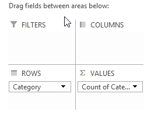
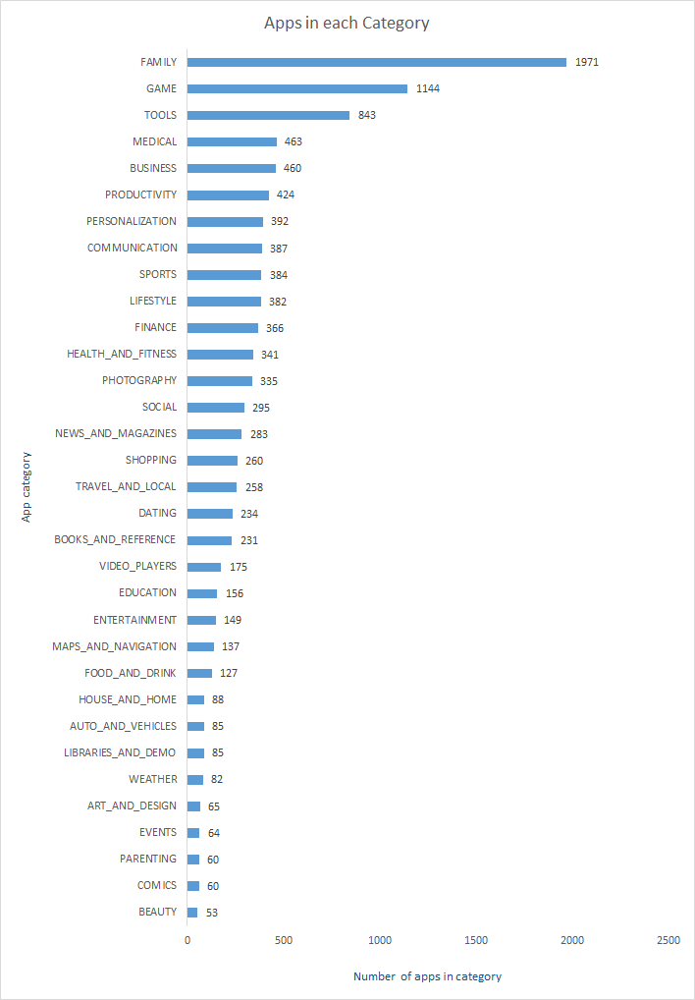
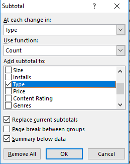
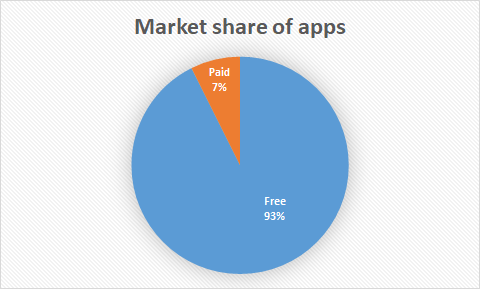
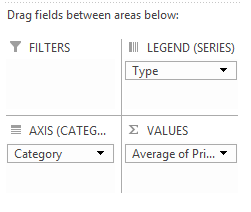
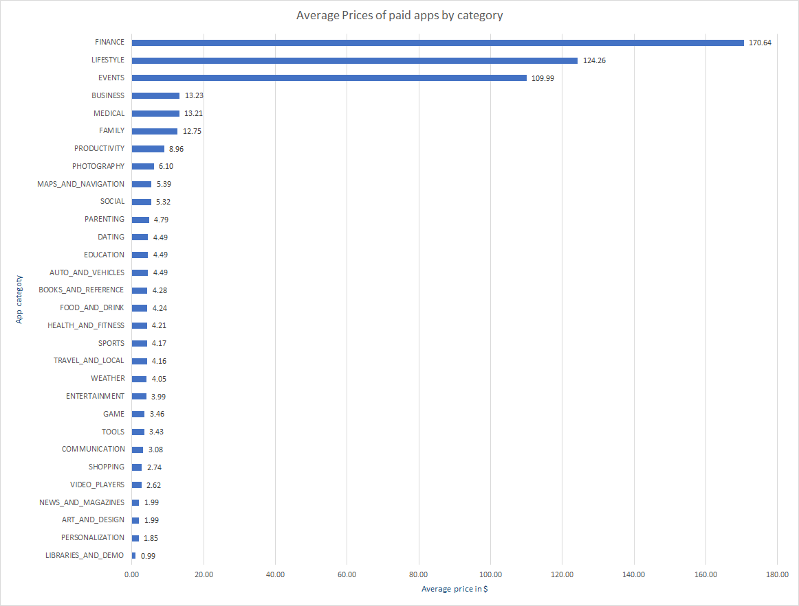
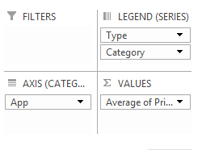
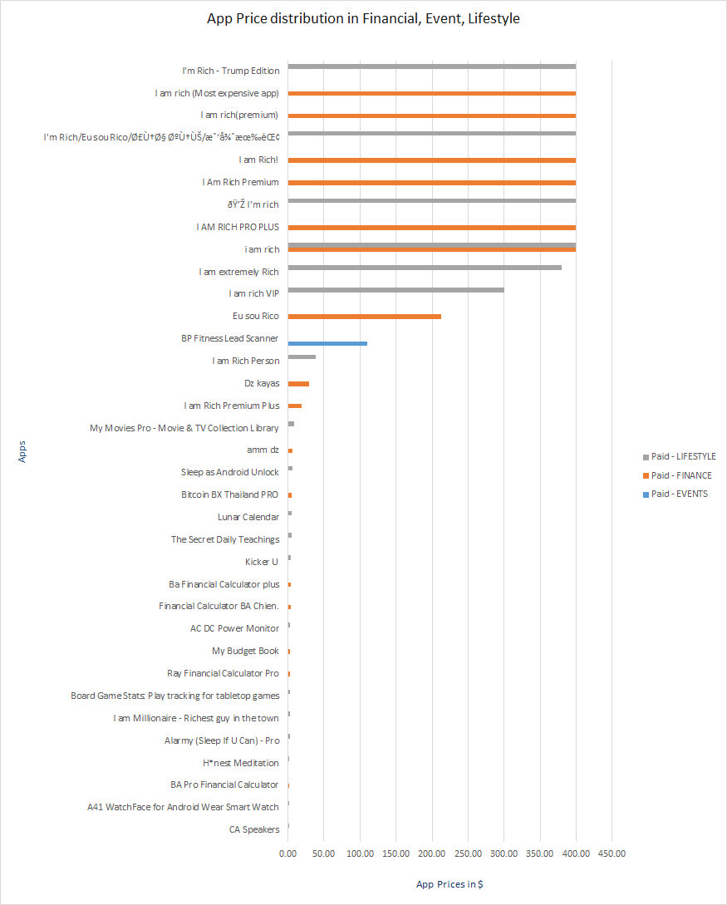
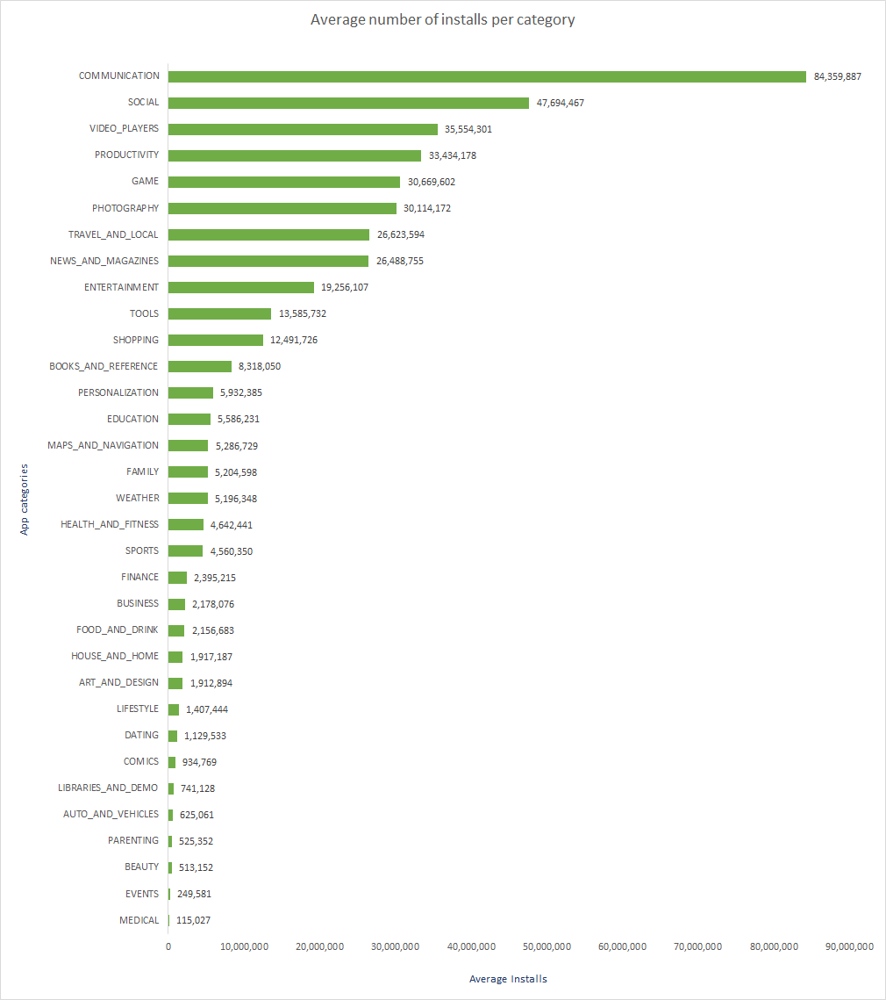
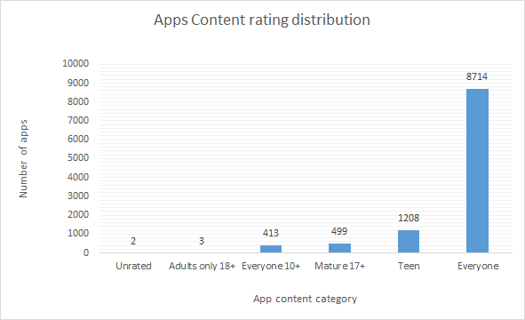

## Analysis of Play store apps 

Data source : <https://www.kaggle.com/lava18/google-play-store-apps#googleplaystore.csv>

**The Play Store apps data has enormous potential to drive app-making businesses to success. Actionable insights can be drawn for developers to work on and capture the Android market!**


| Parameter      | Indicates                                                    |
| -------------- | :----------------------------------------------------------- |
| App            | Application name                                             |
| **Category**   | Category the app belongs to                                  |
| Rating         | Overall user rating of the app (as when scraped)             |
| Reviews        | Number of user reviews for the app (as when scraped)         |
| Size           | Size of the app (as when scraped)                            |
| Installs       | Number of user downloads/installs for the app (as when scraped) |
| Type+          | Paid or Free                                                 |
| Price          | Price of the app (as when scraped)                           |
| Content Rating | Age group the app is targeted at - Children / Mature 21+ / Adult |
| Genres         | An app can belong to multiple genres (apart from its main category). For eg, a musical family game will belong to Music, Game, Family genres. |
| Last Updated   | Date when the app was last updated on Play Store (as when scraped) |
| Current Ver    | Current version of the app available on Play Store (as when scraped) |
| Android Ver    | Min required Android version (as when scraped)               |


What I have tried is finding useful business information about Android market. Which of the things are more profitable and important to know for businesses.


### Number of apps in each category in our dataset.


Using pivot table and plotting category on axis and also category on values, we can get counts of each category right inside pivot table.





After sorting these values from lowest to highest and plotting chart we can get below result.





> ### Family, Games, tools, Medical and Books are the top 5 categories in terms of app counts


### Market shares on basis of types. [Free/Paid]

##### Steps included

First by applying filter on Type column, I have found that It actually have other values along with Free/Paid types. There was one row with **NaN** and one with **0** values, So I Ignored it for sake of simplicity.

Select column and Press,

```
CTRL + H
```

Now we can find Word from Specific column that is selected, and perform operations.

Then sorted all data based on type. For making next step 

Just using subtotal we can easily achieve how many of are them are Free and Paid.




Then collapse the sheet at Level 2, It will show counts for Free and Paid.

We can easily make chart now, I preferred Pie chart for showing Proportion of 100% here.




Conclusion: As we can see Free Apps are dominating the market.  

> #### 93% of apps are available for Free.
>


### Next we will dig further and find App prices for paid apps for each category.

For this, I have created Pivot table for whole table, And added Mapped Category on rows and Types on column. 




And put Price in VALUES, After that By sorting values from Lowest to highest for price and creating bar chart for that will be our output, I have changed many small things in charts design for achieving below chart.





> #### Finance, Lifestyles and Events categories apps are costlier then other categories.
>

Further we can analyze those 3 categories to see why they have such high values?

So, I have made changes in Pivot table and added **App** into Axes part and Moved **type and Category** into Series part of pivot table. as shown below:



And then sort the table prices from Low to High and draw Bar chart will create below chart





**Conclusion:**

> #### There is only a single app for Event category and it's price is 109$ and thus category has higher value overall.
>
> #### Though, In Finance and Lifestyle has more apps with prices less than it's average values there are some apps which have higher prices and thus Average values are higher for categories also.
>
> #### Side note: Those apps which have higher prices shows similarities in their names, and it could be similar types of apps also.


### Let's see in which categories apps has highest installs?

Here, Install column is textual format and not number so we can't really do math over it.

As, values in this column is in format like 25000+ 

We will remove that **+** sign very first and **then convert it to number data type**

Then I took pivot table and calculated Average install counts for each category and plotted them.





> #### Communication and social apps have highest installs as it include giant apps like Facebook, Whatsapp, Instagram etc. followed by video players, Productivity and Games.


### Content rating distribution of apps

There is content rating which every developer must submit for distributing app on play store, This basically indicates the Age group which can use this app.

Categories : **Everyone, Teen, Mature 17+, Everyone 10+, Adults only 18+** 

For getting these counts, I have took simple pivot table of Content rating with it's own count.




> #### Clearly maximum apps are suitable for every age group and also around 11% of apps are targeted for Teens. There are also considerable amount of apps: 5% which are targeting to 17-18+ age users. 


### Top 25 apps with Average ratings on base of Total ratings

| Facebook                                             |
| ---------------------------------------------------- |
| WhatsApp Messenger                                   |
| Instagram                                            |
| Messenger – Text and Video   Chat for Free         |
| Clash of Clans                                       |
| Clean Master- Space Cleaner   & Antivirus            |
| Subway Surfers                                       |
| YouTube                                              |
| Security Master - Antivirus,   VPN, AppLock, Booster |
| Candy Crush Saga                                     |
| Clash Royale                                         |
| Snapchat                                             |
| UC Browser - Fast Download   Private & Secure        |
| 360 Security - Free Antivirus,   Booster, Cleaner    |
| My Talking Tom                                       |
| 8 Ball Pool                                          |
| DU Battery Saver - Battery   Charger & Battery Life  |
| BBM - Free Calls &   Messages                        |
| Cache Cleaner-DU Speed Booster   (booster & cleaner) |
| Twitter                                              |
| Viber Messenger                                      |
| LINE: Free Calls &   Messages                        |
| Skype - free IM & video   calls                      |
| Pokémon GO                                          |
| Pou                                                  |

